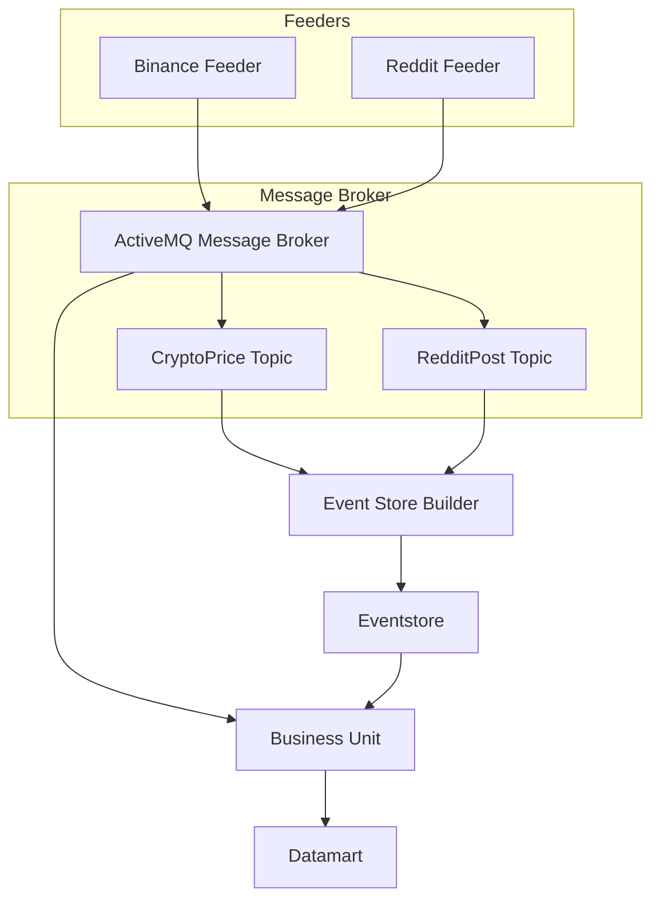

# BitFOMO - Sistema de Análisis de Datos y Soporte a Decisiones en Criptomonedas

## Descripción del Proyecto

BitFOMO es un sistema de análisis de datos para apoyar decisiones de inversión en criptomonedas, específicamente para Bitcoin. El proyecto recopila y analiza datos de precios de Bitcoin desde Binance y el sentimiento de la comunidad en Reddit para generar recomendaciones de inversión automatizadas.

### Propuesta de Valor

- **Análisis Integral**: Combina datos financieros objetivos con análisis de sentimiento de la comunidad para ofrecer una visión más completa que el análisis basado solo en precios.
- **Decisiones Informadas**: Proporciona recomendaciones basadas en datos históricos y tendencias, con una explicación clara de la lógica detrás de cada sugerencia.
- **Procesamiento en Tiempo Real**: La recolección y análisis continuo de datos permite tomar decisiones oportunas (actualmente usando ventanas de 6 horas, pero configurable).
- **Alertas Proactivas**: Notifica a los usuarios sobre cambios significativos en el sentimiento que podrían preceder movimientos de precios.
- **Arquitectura Escalable**: Sistema modular basado en eventos que facilita el mantenimiento y la expansión a otras criptomonedas o fuentes de datos.
- **Soporte a Decisiones**: Reduce la fatiga en la toma de decisiones y el trading emocional mediante recomendaciones respaldadas por datos.

## Justificación de la Selección de APIs y Estructura del Datamart

### APIs Seleccionadas

**Binance API**
- **Justificación**: Binance es uno de los intercambios de criptomonedas más grandes y confiables del mundo.
- **Ventajas**:
  - Datos de alta calidad con precisión de milisegundos.
  - Acceso de baja latencia (esencial para aplicaciones casi en tiempo real).
  - Documentación completa y endpoints estables.
  - Límites de tasa altos adecuados para nuestro intervalo de consulta de 5 minutos.
- **Endpoint usado**: `/api/v3/uiKlines` para datos históricos de velas de BTC/USDT.

**Reddit API**
- **Justificación**: Reddit alberga comunidades importantes de criptomonedas con perspectivas diversas.
- **Ventajas**:
  - Acceso a sentimientos de la comunidad en tiempo real de usuarios conocedores.
  - Múltiples subreddits permiten un muestreo más amplio del sentimiento.
  - El contenido es público y está estructurado adecuadamente para análisis.
- **Subreddits monitoreados**: Bitcoin, CryptoCurrency, CryptoMarkets (Mejora futura: ponderación por importancia de subreddit).

### Estructura del Datamart

El datamart está estructurado como un archivo CSV con las siguientes columnas:

```csv
ts,openPrice,closePrice,sentiment
```

- `ts`: Marca de tiempo del evento (precisión de milisegundos).
- `openPrice`: Precio de apertura de Bitcoin en USDT.
- `closePrice`: Precio de cierre de Bitcoin en USDT.
- `sentiment`: Puntuación de sentimiento (-1 a 1, donde -1 es negativo y 1 es positivo).

Esta estructura permite:
1. **Análisis de Correlación**: Comparación directa entre movimientos de precios y cambios en el sentimiento.
2. **Análisis Temporal**: Evaluación de series temporales del sentimiento antes de cambios de precios.
3. **Detección de Señales**: Identificación de umbrales de sentimiento que preceden movimientos significativos de precios.
4. **Consultas Simplificadas**: Filtrado y agregación sencillos para algoritmos de recomendación.

## Detalles de los Módulos

Cada módulo sigue el patrón de **Hexagonal Architecture** (Clean Architecture), que separa la aplicación en capas con límites claros y dependencias dirigidas hacia el interior.

### Reddit Feeder

El módulo *Reddit Feeder* recopila publicaciones de subreddits relacionados con criptomonedas para análisis de sentimiento.

#### Diagrama de Arquitectura


#### Componentes Clave

- **Controller**: Orquesta el flujo de datos y programa la obtención periódica de publicaciones de Reddit.
- **RedditApi**: Implementa el `ExternalRedditApiPort` para obtener datos de Reddit.
- **RedditConnection**: Maneja la comunicación HTTP con la API de Reddit.
- **RedditDeserializer**: Convierte respuestas JSON en objetos del dominio.
- **MessagePublisher**: Publica eventos en ActiveMQ.

#### Principios de Diseño

- **Principio Abierto/Cerrado**:
  - El módulo está abierto a extensiones (nuevas fuentes de datos) pero cerrado a modificaciones.
  - Agregar nuevas plataformas de redes sociales solo requiere implementar las interfaces adecuadas.
- **Segregación de Interfaz**:
  - Interfaces distintas (`ExternalRedditApiPort`, `EventPublisherPort`) con responsabilidades específicas.
  - Ningún cliente depende de métodos que no usa.
- **Inversión de Dependencias**:
  - Los módulos de alto nivel (Controller) dependen de abstracciones, no de implementaciones concretas.
  - Permite cambiar implementaciones fácilmente (e.g., diferentes message brokers).
- **Responsabilidad Única**:
  - Cada clase tiene una responsabilidad bien definida (obtención, análisis, publicación).
  - Los cambios en un aspecto no afectan a otros (e.g., cambiar el análisis JSON no impacta la lógica HTTP).

#### Patrones de Diseño

- **Strategy Pattern**:
  - `SentimentAnalyzer` permite algoritmos de análisis intercambiables.
  - Diferentes enfoques de análisis de sentimiento pueden integrarse sin cambiar el código cliente.
- **Builder Pattern**:
  - Creación de `RedditPost` con parámetros opcionales.
  - Dos constructores ofrecen flexibilidad en la creación de objetos.
- **Observer Pattern**:
  - Publicación de eventos vía ActiveMQ implementa notificaciones asíncronas.
  - Publicadores y suscriptores están desacoplados mediante el message broker.
- **Adapter Pattern**:
  - `RedditApi` adapta la API externa de Reddit al modelo de dominio interno.
  - Protege el modelo de dominio de cambios en la API externa.
- **Factory Method**:
  - Creación de conexiones y sesiones mediante métodos fábrica en `MessageBrokerConnection`.
  - Encapsula la lógica de creación y simplifica el código cliente.

### Binance Feeder

El módulo *Binance Feeder* es responsable de recopilar datos de precios de criptomonedas desde la API de Binance.

#### Diagrama de Arquitectura

El módulo implementa **Hexagonal Architecture** con capas distintas:


#### Componentes Clave

- **Application**: Punto de entrada que inicializa y programa el proceso de obtención de datos.
- **ExchangeApiClient**: Extiende `ExchangeDataFetcher` para implementar lógica específica de Binance.
- **HttpClient**: Maneja la comunicación HTTP con la API de Binance.
- **ActiveMQEventPublisher**: Publica datos de velas en el message broker.
- **CandlestickSerializer/Deserializer**: Convierte entre JSON y objetos del dominio.

#### Principios de Diseño

- **Responsabilidad Única**:
  - Cada clase tiene un enfoque específico (acceso a API, comunicación HTTP, serialización).
  - Los cambios en un aspecto no afectan a otros.
- **Inversión de Dependencias**:
  - Los módulos de alto nivel dependen de abstracciones mediante interfaces.
  - Los detalles de implementación están aislados detrás de interfaces.
- **Segregación de Interfaz**:
  - Interfaces específicas (`HttpClientProvider`, `EventPublisherPort`) con responsabilidades enfocadas.
  - Los clientes solo dependen de los métodos que usan.
- **Sustitución de Liskov**:
  - `ExchangeApiClient` extiende `ExchangeDataFetcher` y puede usarse en su lugar.
  - Comportamiento polimórfico mediante implementaciones de interfaces.

#### Patrones de Diseño

- **Repository Pattern**:
  - La lógica de acceso a datos está encapsulada en `ExchangeApiClient`.
  - Proporciona una separación clara entre dominio y acceso a datos.
- **Adapter Pattern**:
  - `ExchangeApiClient` adapta la API de Binance al modelo de dominio de la aplicación.
  - `HttpClient` adapta el cliente HTTP de Java a las necesidades de la aplicación.
- **Factory Pattern**:
  - `HttpClient` crea recursos HTTP mediante métodos fábrica.
  - Encapsula la lógica de creación para clientes y solicitudes HTTP.
- **Template Method**:
  - `ExchangeDataFetcher` define la estructura del algoritmo.
  - `ExchangeApiClient` proporciona implementaciones específicas.

#### Características Clave

- Obtiene datos de velas (OHLCV) para pares de trading de Bitcoin.
- Rastrea la última hora de obtención para evitar datos duplicados.
- Convierte datos de la API externa a objetos del dominio.
- Manejo robusto de errores con reintentos.
- Intervalos de obtención configurables.

### Event Store Builder

El módulo *Event Store Builder* persiste todos los eventos del sistema para análisis histórico y recuperación del sistema.

#### Diagrama de Arquitectura


#### Componentes Clave

- **MessageReceiver**: Se suscribe a tópicos de ActiveMQ para recibir eventos.
- **EventStore**: Persiste eventos en el sistema de archivos en una estructura de directorios organizada.
- **Deduplicator**: Evita el almacenamiento de eventos duplicados.

#### Principios de Diseño

- **Responsabilidad Única**:
  - `MessageReceiver` se enfoca solo en recibir mensajes.
  - `EventStore` maneja únicamente la lógica de persistencia.
  - `Deduplicator` se encarga solo de detectar duplicados.
- **Acoplamiento Bajo**:
  - Los componentes se comunican mediante interfaces bien definidas.
  - Los cambios en un componente no se propagan a otros.
  - Comunicación asíncrona basada en mensajes con otros módulos.
- **Alta Cohesión**:
  - La funcionalidad relacionada está agrupada.
  - Cada clase tiene un propósito claro y enfocado.
  - Los métodos dentro de las clases persiguen un objetivo común.
- **DRY (No te Repitas)**:
  - La funcionalidad común se extrae a métodos compartidos.
  - Evita la duplicación de lógica entre componentes.
  - Manejo centralizado de errores y logging.

#### Patrones de Diseño

- **Event Sourcing**:
  - Todos los cambios se almacenan como una secuencia de eventos.
  - El estado del sistema puede reconstruirse al reproducir eventos.
  - Proporciona un registro completo y consultas temporales.
- **Publisher-Subscriber**:
  - Comunicación desacoplada mediante el message broker.
  - Los tópicos permiten entrega selectiva de mensajes.
  - Suscripciones duraderas aseguran la entrega de mensajes.
- **Repository Pattern**:
  - `EventStore` proporciona una capa centralizada de acceso a datos.
  - Almacenamiento y recuperación organizados de eventos.
  - Abstrae los detalles del sistema de archivos subyacente.
- **Singleton Pattern**:
  - Una sola instancia de `EventStore` gestiona toda la persistencia.
  - Asegura acceso consistente y coordinado al sistema de archivos.
  - Evita conflictos de escritura concurrentes.

#### Detalles de Implementación

- **Estructura de Directorios**:
  ```
  src/main/eventstore/
  ├── RedditPost/
  │   └── reddit-feeder/
  │       └── YYYYMMDD.events
  └── CryptoPrice/
      └── binance-feeder/
          └── YYYYMMDD.events
  ```

- **Formato de Archivo de Eventos**:
  Cada evento se almacena como un objeto JSON en una sola línea, conteniendo:
  - Marca de tiempo (`ts`).
  - Sistema fuente (`ss`).
  - Datos específicos del evento.

- **Estrategia de Deduplicación**:
  - Caché en memoria de IDs de eventos procesados.
  - Persistencia de IDs para evitar duplicados tras reinicios.
  - Búsquedas eficientes usando estructuras de datos basadas en hash.

### Business Unit

El módulo *Business Unit* procesa datos de múltiples fuentes para generar recomendaciones de inversión.

#### Diagrama de Arquitectura

# FOTO DIAGRAMA BUSINESS-UNIT

#### Componentes Clave

- **DatamartEnsembler**: Correlaciona y procesa datos de múltiples fuentes.
- **ActiveMQListener**: Se suscribe a tópicos del message broker.
- **CLIUserInterface**: Proporciona interacción con el usuario y muestra recomendaciones.
- **RecommendationService**: Implementa algoritmos de recomendación de inversión.
- **SentimentAnalyzer**: Analiza el sentimiento de textos usando la librería VADER de Python.

#### Principios de Diseño

- **Separación de Responsabilidades**:
  - La capa de interfaz (`CLIUserInterface`) está separada de la lógica de negocio.
  - El procesamiento de datos (`DatamartEnsembler`) es distinto del análisis (`RecommendationService`).
  - Las preocupaciones de integración (`ActiveMQListener`) están aisladas de la lógica del dominio.
- **Principios SOLID**:
  - Responsabilidad Única: Cada clase tiene un propósito bien definido.
  - Abierto/Cerrado: Nuevos algoritmos de recomendación pueden añadirse sin modificaciones.
  - Sustitución de Liskov: Las implementaciones son sustituibles por sus interfaces.
  - Segregación de Interfaz: Interfaces específicas y enfocadas.
  - Inversión de Dependencias: Los módulos de alto nivel dependen de abstracciones.
- **Separación de Comandos y Consultas**:
  - Los comandos (`processMessage`) cambian el estado pero no devuelven valores.
  - Las consultas (`getRecommendation`) devuelven valores pero no cambian el estado.
  - Distinción clara entre operaciones que modifican y leen datos.

#### Patrones de Diseño

- **Command Pattern**:
  - Los comandos CLI se tratan como objetos.
  - Cada comando encapsula toda la información necesaria para su ejecución.
  - Los comandos pueden extenderse fácilmente sin modificar el código cliente.
- **Template Method**:
  - Estructura común para el procesamiento de recomendaciones.
  - Pasos específicos pueden ser sobrescritos por subclases.
  - Asegura una estructura de algoritmo consistente con partes personalizables.
- **Cache Pattern**:
  - Caché en memoria de datos de Reddit y Binance.
  - Mejora el rendimiento para búsquedas de datos correlacionados en el tiempo.
  - Reduce el procesamiento repetido de los mismos datos.
- **Observer Pattern**:
  - *Business Unit* observa cambios vía el message broker.
  - Reacciona a nuevos eventos de datos sin polling.
  - Acoplamiento bajo entre productores y consumidores de datos.
- **Strategy Pattern**:
  - Diferentes estrategias de recomendación pueden integrarse.
  - Los algoritmos pueden seleccionarse en tiempo de ejecución.
  - Nuevas estrategias pueden añadirse sin cambiar el código existente.

#### Algoritmo de Recomendación

El algoritmo de recomendación considera dos factores principales:
1. **Sentimiento de la Comunidad**: Analizado desde publicaciones de Reddit (escala de -1 a 1).
2. **Tendencia de Precios**: Calculada desde diferencias entre precios de apertura y cierre.

Lógica de decisión:
- **Comprar** cuando el sentimiento es positivo (≥ 0.1).
- **Vender** cuando el sentimiento es negativo (≤ -0.1) y el precio está en declive.
- **Mantener** cuando el sentimiento es neutral o contradice el movimiento de precios.

Este enfoque combina principios fundamentales de finanzas conductuales y análisis técnico.

## Arquitectura del Sistema

El sistema sigue una **Event-Driven Architecture (EDA)** con una clara separación de responsabilidades:



### Interacciones de Componentes

1. **Capa de Feeders**: Recopila datos de fuentes externas de forma autónoma.
   - *Binance Feeder* obtiene datos de precios de criptomonedas cada 5 minutos.
   - *Reddit Feeder* recolecta publicaciones de subreddits de criptomonedas cada 5 minutos.
2. **Capa de Message Broker**: Proporciona acoplamiento bajo mediante comunicación asíncrona.
   - ActiveMQ gestiona la distribución de mensajes a múltiples suscriptores.
   - La mensajería basada en tópicos permite consumo selectivo.
3. **Capa de Almacenamiento de Eventos**: Implementa *event sourcing* para la persistencia de datos.
   - *Event Store Builder* persiste todos los eventos con marcas de tiempo.
   - Estructura de archivos organizada permite recuperación eficiente.
   - Habilita recuperación del sistema y capacidades de reproducción.
4. **Capa de Análisis**: Procesa datos combinados para obtener insights de negocio.
   - *Business Unit* correlaciona datos de precios y sentimiento.
   - El datamart proporciona una estructura optimizada para algoritmos de análisis.
   - El motor de recomendaciones genera consejos de inversión accionables.

### Flujo de Datos

1. Los *Feeders* recopilan datos de APIs externas y los convierten en eventos del dominio.
2. Los eventos se publican en tópicos respectivos en el message broker.
3. *Event Store Builder* se suscribe a todos los tópicos y persiste eventos por tipo y fecha.
4. *Business Unit* también se suscribe a tópicos, procesa eventos y actualiza el datamart.
5. La interfaz CLI consulta el datamart para generar recomendaciones de inversión.

## Instrucciones para Compilar y Ejecutar

### Prerrequisitos

- Java 21 o superior.
- Maven 3.6+.
- Apache ActiveMQ v6.1.6.
- Python 3.8+ con librerías:
  - `vaderSentiment`.

### Compilación

```bash
mvn clean compile

mvn clean package
```

### Ejecución del Broker

**Ubuntu v24.04.2**
```bash
./activemq start
```

**Windows 11**
```PowerShell
.\activemq.bat start
```

## Ejemplos de Uso

### Comandos CLI

- `recommend`: Genera una recomendación de inversión basada en las últimas 48 horas.
- `help`: Muestra ayuda para los comandos disponibles.
- `exit`: Sale de la aplicación.

## Tecnologías Usadas

- **Java 21**: Lenguaje principal.
- **Maven**: Gestión de dependencias.
- **ActiveMQ**: Message broker para comunicación asíncrona.
- **SQLite**: Base de datos ligera para persistencia.
- **Jackson**: Serialización/deserialización JSON.
- **OkHttp**: Cliente HTTP para llamadas a APIs.
- **JUnit 5**: Framework de pruebas.
- **VaderSentiment**: Análisis de sentimiento basado en Python.

## Estructura del Proyecto

```
BitFOMO/
├── binance-feeder/          
├── reddit-feeder/             
├── event-store-builder/     
├── business-unit/           
├── datamart.csv             
├── pom.xml                  
└── README.md                
```

## Consideraciones de Desarrollo

- **Manejo de Errores**: Implementación robusta de try-catch y logging.
- **Concurrencia**: Uso de `ScheduledExecutorService` para tareas periódicas.
- **Configurabilidad**: Parámetros externalizados mediante argumentos de línea de comandos.
- **Testeabilidad**: Interfaces e inyección de dependencias para pruebas unitarias.
- **Extensibilidad**: Diseño modular permite añadir nuevas fuentes de datos.

## Mejoras Futuras

- Soporte para más criptomonedas.
- Análisis de sentimiento avanzado con machine learning.
- Interfaz web para visualización.
- Capacidades de backtesting para validar estrategias.
- Integración con plataformas de trading para trading automatizado.