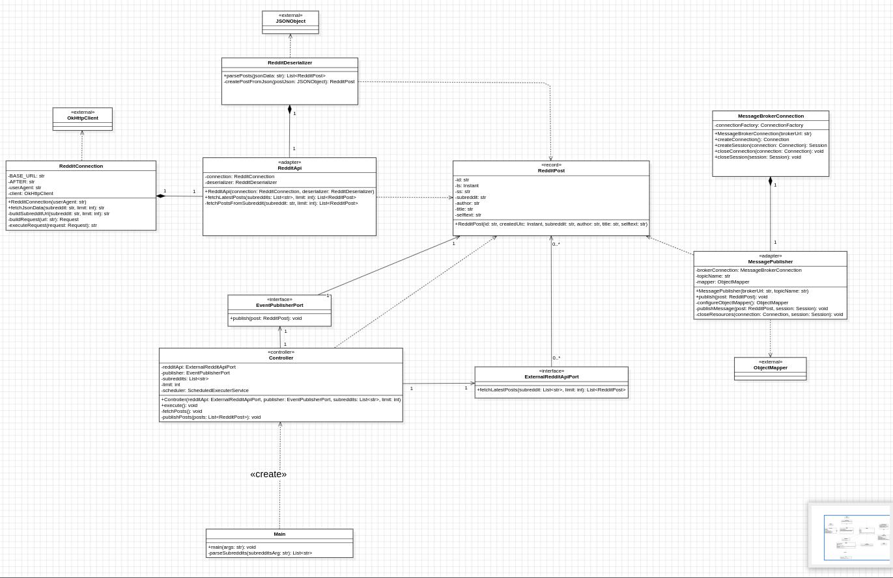
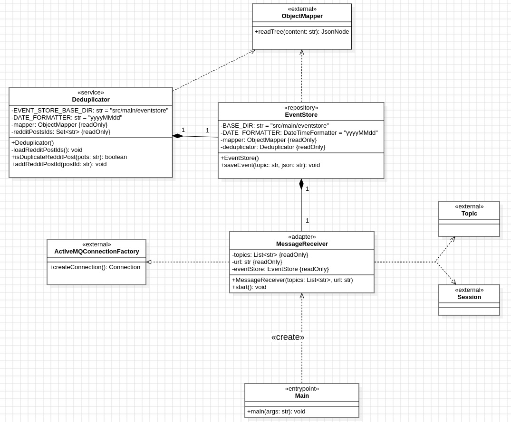
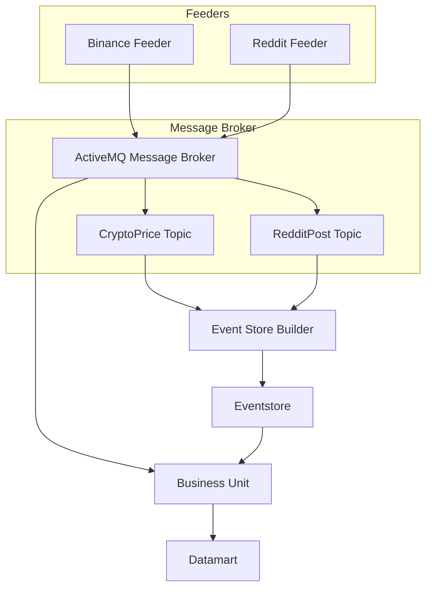

# BitFOMO - Data Analysis and Cryptocurrency Decision Support System

## Project Description

BitFOMO is a data analysis system for supporting cryptocurrency investment decisions, specifically for Bitcoin. The project collects and analyzes Bitcoin price data from Binance and community sentiment from Reddit to generate automated investment recommendations.

### Value Proposition

- **Comprehensive Analysis**: Combines objective financial data with community sentiment analysis to provide a more holistic view than traditional price-only analysis
- **Informed Decisions**: Provides recommendations based on historical data and trends with a clear explanation of rationale behind each suggestion
- **Real-time Processing**: Continuous data collection and analysis enables timely decision-making (currently using 6-hour windows, but configurable)
- **Proactive Alerts**: Notifies users of significant sentiment shifts that might precede price movements
- **Scalable Architecture**: Modular event-driven system allowing easy maintenance and expansion to additional cryptocurrencies or data sources
- **Decision Support**: Reduces decision fatigue and emotional trading through data-backed recommendations

## Justification of API Selection and Datamart Structure

### APIs Selected

**Binance API**
- **Justification**: Binance is one of the world's largest and most reliable cryptocurrency exchanges
- **Advantages**:
    - High-quality data with millisecond precision
    - Low latency access (essential for near real-time applications)
    - Comprehensive documentation and stable endpoints
    - High rate limits suitable for our 5-minute polling interval
- **Endpoint used**: `/api/v3/uiKlines` for historical candlestick data of BTC/USDT

**Reddit API**
- **Justification**: Reddit hosts major cryptocurrency communities with diverse perspectives
- **Advantages**:
    - Access to real-time community sentiment from knowledgeable users
    - Multiple subreddits provide broader sentiment sampling
    - Content is public and properly structured for analysis
- **Subreddits monitored**: Bitcoin, CryptoCurrency, CryptoMarkets (Future enhancement: weighted importance by subreddit)

### Datamart Structure

The datamart is structured as a CSV file with the following columns:

```csv
ts,openPrice,closePrice,sentiment
```

- `ts`: Timestamp of the event (millisecond precision)
- `openPrice`: Opening price of Bitcoin in USDT
- `closePrice`: Closing price of Bitcoin in USDT
- `sentiment`: Sentiment score (-1 to 1, where -1 is negative and 1 is positive)

This structure enables:
1. **Correlation Analysis**: Direct comparison between price movements and sentiment shifts
2. **Temporal Analysis**: Time-series evaluation of sentiment preceding price changes
3. **Signal Detection**: Identification of sentiment thresholds that precede significant price movements
4. **Simplified Queries**: Straightforward filtering and aggregation for recommendation algorithms

## Module Details

Each module follows the Hexagonal Architecture (Clean Architecture) pattern which separates the application into layers with clear boundaries and dependencies pointing inward:

### Reddit Feeder

The Reddit Feeder module collects posts from cryptocurrency-related subreddits for sentiment analysis.

#### Architecture Diagram



#### Key Components

- **Controller**: Orchestrates the data flow and schedules periodic Reddit post fetching
- **RedditApi**: Implements the `ExternalRedditApiPort` to fetch data from Reddit
- **RedditConnection**: Handles HTTP communication with Reddit's API
- **RedditDeserializer**: Converts JSON responses to domain objects
- **MessagePublisher**: Publishes events to ActiveMQ

#### Design Principles

- **Open/Closed Principle**:
    - The module is open for extension (new data sources) but closed for modification
    - Adding new social media platforms requires only implementing the appropriate interfaces

- **Interface Segregation**:
    - Distinct interfaces (`ExternalRedditApiPort`, `EventPublisherPort`) with focused responsibilities
    - No client is forced to depend on methods it doesn't use

- **Dependency Inversion**:
    - High-level modules (Controller) depend on abstractions, not concrete implementations
    - This enables easy swapping of implementations (e.g., different message brokers)

- **Single Responsibility Principle**:
    - Each class has a well-defined responsibility (fetching, parsing, publishing)
    - Changes to one aspect don't affect others (e.g., changing JSON parsing won't impact HTTP logic)

#### Design Patterns

- **Strategy Pattern**:
    - `SentimentAnalyzer` allows interchangeable analysis algorithms
    - Different sentiment analysis approaches can be plugged in without changing client code

- **Builder Pattern**:
    - `RedditPost` creation with optional parameters
    - Two constructors provide flexibility in object creation

- **Observer Pattern**:
    - Event publication via ActiveMQ implements async notification
    - Publishers and subscribers are decoupled through the message broker

- **Adapter Pattern**:
    - `RedditApi` adapts external Reddit API to the internal domain model
    - Shields the domain model from external API changes

- **Factory Method**:
    - Creation of connections and sessions through factory methods in `MessageBrokerConnection`
    - Encapsulates creation logic and simplifies client code

### Binance Feeder

The Binance Feeder module is responsible for collecting cryptocurrency price data from the Binance exchange API.

#### Architecture Diagram

The module implements Hexagonal Architecture with distinct layers:

# FOTO DEL DIAGRAMA/ BINANCE-FEEDER

#### Key Components

- **Application**: Entry point that initializes and schedules the data fetching process
- **ExchangeApiClient**: Extends ExchangeDataFetcher to implement Binance-specific logic
- **HttpClient**: Handles HTTP communication with the Binance API
- **ActiveMQEventPublisher**: Publishes candlestick data to the message broker
- **CandlestickSerializer/Deserializer**: Convert between JSON and domain objects

#### Design Principles

- **Single Responsibility Principle**:
    - Each class has a specific focus (API access, HTTP communication, serialization)
    - Changes to one aspect don't affect others

- **Dependency Inversion Principle**:
    - High-level modules depend on abstractions via interfaces
    - Implementation details are isolated behind interfaces

- **Interface Segregation Principle**:
    - Specific interfaces (HttpClientProvider, EventPublisherPort) with focused responsibilities
    - Clients only depend on the methods they use

- **Liskov Substitution Principle**:
    - ExchangeApiClient extends ExchangeDataFetcher and can be used in its place
    - Polymorphic behavior through interface implementations

#### Design Patterns

- **Repository Pattern**:
    - Data access logic is encapsulated in the ExchangeApiClient
    - Provides clean separation between domain and data access

- **Adapter Pattern**:
    - ExchangeApiClient adapts the Binance API to the application's domain model
    - HttpClient adapts Java's HTTP client to the application's needs

- **Factory Pattern**:
    - HttpClient creates HTTP resources through factory methods
    - Encapsulates creation logic for HTTP clients and requests

- **Template Method**:
    - ExchangeDataFetcher defines the algorithm structure
    - ExchangeApiClient provides specific implementations

#### Key Features

- Retrieves candlestick data (OHLCV) for Bitcoin trading pairs
- Tracks last fetch time to avoid duplicate data
- Converts external API data to domain objects
- Robust error handling with retries
- Configurable fetch intervals

### Event Store Builder

The Event Store Builder module persists all events from the system for historical analysis and system recovery.

#### Architecture Diagram



#### Key Components

- **MessageReceiver**: Subscribes to ActiveMQ topics to receive events
- **EventStore**: Persists events to filesystem in an organized directory structure
- **Deduplicator**: Prevents duplicate events from being stored

#### Design Principles

- **Single Responsibility Principle**:
    - MessageReceiver focuses solely on receiving messages
    - EventStore handles only persistence logic
    - Deduplicator is responsible only for duplicate detection

- **Loose Coupling**:
    - Components communicate through well-defined interfaces
    - Changes to one component don't propagate to others
    - Asynchronous message-based communication with other modules

- **High Cohesion**:
    - Related functionality is grouped together
    - Each class has a clear, focused purpose
    - Methods within classes serve a common goal

- **DRY (Don't Repeat Yourself)**:
    - Common functionality extracted to shared methods
    - Avoids duplication of logic across components
    - Centralized error handling and logging

#### Design Patterns

- **Event Sourcing**:
    - All changes are stored as a sequence of events
    - System state can be reconstructed by replaying events
    - Provides complete audit trail and temporal queries

- **Publisher-Subscriber**:
    - Decoupled communication via message broker
    - Topics provide selective message delivery
    - Durable subscriptions ensure message delivery

- **Repository Pattern**:
    - EventStore provides a centralized data access layer
    - Organized storage and retrieval of events
    - Abstracts the underlying file system details

- **Singleton Pattern**:
    - Single EventStore instance manages all persistence
    - Ensures consistent, coordinated access to the file system
    - Prevents concurrent write conflicts

#### Implementation Details

- **Directory Structure**:
  ```
  src/main/eventstore/
  ├── RedditPost/
  │   └── reddit-feeder/
  │       └── YYYYMMDD.events
  └── CryptoPrice/
      └── binance-feeder/
          └── YYYYMMDD.events
  ```

- **Event File Format**:
  Each event is stored as a JSON object on a single line, containing:
    - Timestamp (ts)
    - Source system (ss)
    - Event-specific data

- **Deduplication Strategy**:
    - In-memory cache of processed event IDs
    - Persistence of IDs to prevent duplicates across restarts
    - Efficient lookups using hash-based data structures

### Business Unit

The Business Unit module processes data from multiple sources to generate investment recommendations.

#### Architecture Diagram

# FOTO DIAGRAMA BUSINESS-UNIT


#### Key Components

- **DatamartEnsembler**: Correlates and processes data from multiple sources
- **ActiveMQListener**: Subscribes to message broker topics
- **CLIUserInterface**: Provides user interaction and displays recommendations
- **RecommendationService**: Implements investment recommendation algorithms
- **SentimentAnalyzer**: Analyzes text sentiment using Python's VADER library

#### Design Principles

- **Separation of Concerns**:
    - UI layer (CLIUserInterface) is separate from business logic
    - Data processing (DatamartEnsembler) is distinct from analysis (RecommendationService)
    - Integration concerns (ActiveMQListener) are isolated from domain logic

- **SOLID Principles**:
    - Single Responsibility: Each class has a well-defined purpose
    - Open/Closed: New recommendation algorithms can be added without modification
    - Liskov Substitution: Implementations are substitutable for their interfaces
    - Interface Segregation: Focused, specific interfaces
    - Dependency Inversion: High-level modules depend on abstractions

- **Command-Query Separation**:
    - Commands (processMessage) change state but don't return values
    - Queries (getRecommendation) return values but don't change state
    - Clear distinction between operations that modify and read data

#### Design Patterns

- **Command Pattern**:
    - CLI commands are treated as objects
    - Each command encapsulates all information needed for execution
    - Commands can be extended easily without modifying client code

- **Template Method**:
    - Common structure for recommendation processing
    - Specific steps can be overridden by subclasses
    - Ensures consistent algorithm structure with customizable parts

- **Cache Pattern**:
    - In-memory caching of Reddit and Binance data
    - Improves performance for time-correlated data lookups
    - Reduces repeated processing of the same data

- **Observer Pattern**:
    - Business Unit observes changes via message broker
    - Reacts to new data events without polling
    - Loose coupling between data producers and consumers

- **Strategy Pattern**:
    - Different recommendation strategies can be plugged in
    - Algorithms can be selected at runtime
    - New strategies can be added without changing existing code

#### Recommendation Algorithm

The recommendation algorithm considers two primary factors:
1. **Community Sentiment**: Analyzed from Reddit posts (-1 to 1 scale)
2. **Price Trend**: Calculated from open/close price differences

Decision logic:
- **Buy** when sentiment is positive (≥ 0.1)
- **Sell** when sentiment is negative (≤ -0.1) and price is declining
- **Hold** when sentiment is neutral or contradicting price movement

This approach combines fundamental principles from behavioral finance and technical analysis.

## System Architecture

The system follows an Event-Driven Architecture (EDA) with clear separation of concerns:



### Component Interactions

1. **Feeders Layer**: Autonomously collect data from external sources
    - Binance Feeder retrieves cryptocurrency price data at 5-minute intervals
    - Reddit Feeder harvests posts from cryptocurrency subreddits at 5-minute intervals

2. **Message Broker Layer**: Provides loose coupling through asynchronous communication
    - ActiveMQ handles message distribution to multiple subscribers
    - Topic-based messaging allows selective consumption

3. **Event Store Layer**: Implements event sourcing for data persistence
    - Event Store Builder persists all events with timestamps
    - Organized file structure allows efficient retrieval
    - Enables system recovery and replay capabilities

4. **Analysis Layer**: Processes combined data for business insights
    - Business Unit correlates price and sentiment data
    - Datamart provides optimized structure for analysis algorithms
    - Recommendation engine generates actionable investment advice

### Data Flow

1. Feeders collect data from external APIs and convert to domain events
2. Events are published to respective topics in the message broker
3. Event Store Builder subscribes to all topics and persists events by type and date
4. Business Unit also subscribes to topics, processes events, and updates the datamart
5. CLI interface queries the datamart to generate investment recommendations

## Build and Run Instructions

### Prerequisites

- Java 21 or higher
- Maven 3.6+
- Apache ActiveMQ v6.1.6
- Python 3.8+ with libraries:
    - `vaderSentiment`

### Compilation

```bash
mvn clean compile

mvn clean package
```

### Execution of broker
**Ubuntu v24.04.2**
```bash
./activemq start
```

**Windows 11**
```PowerShell
.\activemq.bat start
```

## Usage Examples

### CLI Commands

- `recommend`: Generates investment recommendation based on the last 48 hours
- `help`: Shows help for available commands
- `exit`: Exits the application

## Technologies Used

- **Java 21**: Primary language
- **Maven**: Dependency management
- **ActiveMQ**: Message broker for asynchronous communication
- **SQLite**: Lightweight database for persistence
- **Jackson**: JSON serialization/deserialization
- **OkHttp**: HTTP client for API calls
- **JUnit 5**: Testing framework
- **VaderSentiment**: Python-based sentiment analysis

## Project Structure

```
BitFOMO/
├── binance-feeder/          
├── reddit-feeder/             
├── event-store-builder/     
├── business-unit/           
├── datamart.csv             
├── pom.xml                  
└── README.md                
```

## Development Considerations

- **Error Handling**: Robust implementation of try-catch and logging
- **Concurrency**: Use of `ScheduledExecutorService` for periodic tasks
- **Configurability**: Externalized parameters via command-line arguments
- **Testability**: Interfaces and dependency injection for unit testing
- **Extensibility**: Modular design allows adding new data sources

## Future Enhancements

- Support for additional cryptocurrencies
- Advanced sentiment analysis with machine learning
- Web interface for visualization
- Backtesting capabilities for strategy validation
- Integration with trading platforms for automated trading